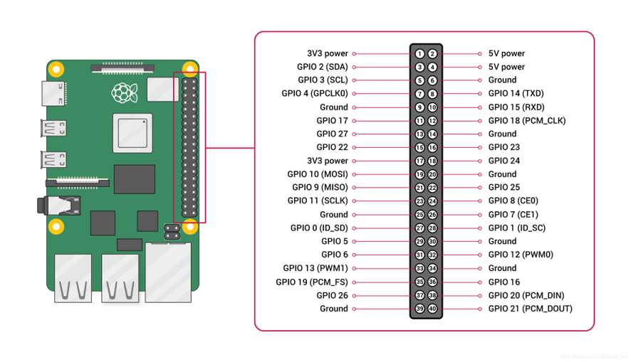
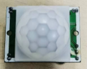
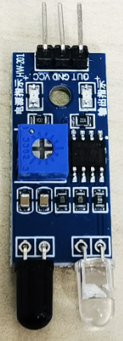
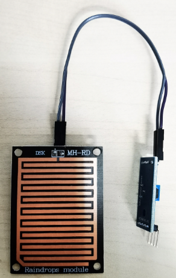

# AI Installation Art
Artificial Intelligence Installation Art Official Course Page of ICCI SJTU

## 依赖软件

### VSCode:

- Windows操作系统 [百度云盘(94MB)](https://pan.baidu.com/s/1k5JZnlkknpYw7oM1c5RBow?pwd=sjtu)

- Mac操作系统 [百度云盘(209MB)](https://pan.baidu.com/s/13A3Hu8ykKwe2z6wMne_gYQ?pwd=sjtu)

- 直接上微软官网下载 [vscode](https://code.visualstudio.com/docs/?dv=osx)

### putty:

- Windows操作系统 [百度云盘(1.6MB)](https://pan.baidu.com/s/1PLshdwW4WLV8HLf6cRgvaw?pwd=sjtu)

## 实验

## SSH连接树莓派：

***绿色(8C:42)***:
```
ssh aiart@192.168.31.203
```

***蓝色(5A:F5)***:
```
ssh aiart@192.168.31.98
```

***粉红色(8C:C2)***:
```
ssh aiart@192.168.31.81
```

***ip地址在课堂上即时获取***

### 树莓派IO接口



### 实验一--人体动作检测传感器：

传感器实物图：



参考代码：

```
from gpiozero import MotionSensor
from signal import pause

def motion_func():
      print(“Motion detected!”) 

def no_motion_func():
      print(“Waiting for motion!”) 


pir = MotionSensor(17)

pir.when_motion = motion_func pir.when_no_motion = no_motion_func
pause()

```

### 实验二--红外传感器：

参考代码：



```
from gpiozero import Button
from signal import pause
switch = Button(16)

def capture_on():
    print("On")

def capture_off():
    print("Off")

switch.when_pressed = capture_on
switch.when_released = capture_off
pause()

```


### 实验三：雨滴传感器



```
from gpiozero import Button
from signal import pause
rain_sensor = Button(16)

def capture_on():
    print("Water detected!")

def capture_off():
    print("No water!")

rain_sensor.when_pressed = capture_on
rain_sensor.when_released = capture_off
pause()

```

## 实验四：声音传感器：

