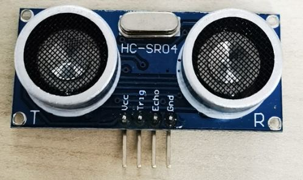

# AI Installation Art
Artificial Intelligence Installation Art Official Course Page of ICCI SJTU

## 依赖软件

### VSCode:

- Windows操作系统 [百度云盘(94MB)](https://pan.baidu.com/s/1k5JZnlkknpYw7oM1c5RBow?pwd=sjtu)

- Mac操作系统 [百度云盘(209MB)](https://pan.baidu.com/s/13A3Hu8ykKwe2z6wMne_gYQ?pwd=sjtu)

- 直接上微软官网下载 [vscode](https://code.visualstudio.com/docs/?dv=osx)

### putty:

- Windows操作系统 [百度云盘(1.6MB)](https://pan.baidu.com/s/1PLshdwW4WLV8HLf6cRgvaw?pwd=sjtu)

## 实验

## SSH连接树莓派：

***绿色(8C:42)***:
```
ssh aiart@192.168.31.203
```

***蓝色(5A:F5)***:
```
ssh aiart@192.168.31.98
```

***粉红色(8C:C2)***:
```
ssh aiart@192.168.31.81
```

***ip地址在课堂上即时获取***

## 作业提交

作业提交网址（jbox）：[jbox](https://jbox.sjtu.edu.cn/l/m1pRBu)   

## 树莓派IO接口


## 实验及代码
### 实验一--红外传感器：

参考代码：


```
from gpiozero import Button
import time

switch = Button(17)

while True:
    if switch.is_pressed:
        pass
    else:
        print("Object detected!")
    time.sleep(0.2) # 以每秒5次的频率检测，
                    # 也就是5Hz检测频率

```

***随堂练习***

```
from gpiozero import Button
import time

switch = Button(17)

while True:
    if switch.is_pressed:
        pass
    else:
        count = count + 1
        if count == 10:
            print("Object was detected {} times".format(count))
            count = 0
    time.sleep(0.2) # 以每秒5次的频率检测，
                    # 也就是5Hz检测频率
```

### 实验二--人体动作检测传感器：

传感器实物图：


参考代码：

```
from gpiozero import MotionSensor
import time

pir = MotionSensor(14)

while True:
    if pir.motion_detected:
        # 获得当前时间的格式化字符串
        time_str = time.strftime("%Y-%m-%d %H:%M:%S", time.localtime())
        print("{}, motion detected!".format(time_str))
    else:
        pass
    time.sleep(0.2) # 以每秒5次的频率检测，
                    # 也就是5Hz检测频率

```

### 实验三：雨滴传感器

传感器实物图：


```
from gpiozero import Button
import time
switch = Button(26)

while True:
    if switch.is_pressed:
        time_str = time.strftime("%Y-%m-%d %H:%M:%S", time.localtime())
        print("{}, water detected!".format(time_str))
    else:
        pass
    time.sleep(0.2) # 以每秒5次的频率检测，
                    # 也就是5Hz检测频率

```

***随堂练习***

```
from gpiozero import Button
import time
switch = Button(26)

count  = 0

total_count = int(5 / 0.2) # 将5秒换算成检测到的次数

while True:
    if switch.is_pressed:
        count = count + 1
        if count >= total_count:
            print("The object was immersed in water for more than 5 seconds!")
            count = 0 # 计数置零，从头计数
    else:
        count = 0 # 一旦期间有一次被检测到没有泡在水里直接置零
    time.sleep(0.2) # 以每秒5次的频率检测，
                    # 也就是5Hz检测频率
```

## 实验四：超声波传感器：

传感器实物图：



```
from gpiozero import DistanceSensor
from time import sleep
sensor = DistanceSensor(echo=23, trigger=24)

while True:
    print('Distance to nearest object is', sensor.distance, 'm')
    sleep(1)
```

***随堂练习***

```
from gpiozero import DistanceSensor
from time import sleep
sensor = DistanceSensor(echo=23, trigger=24)

while True:
    if sensor.distance <= 0.1:
        print("Alert: The object is less than 10cm away from us")
    sleep(1)
```